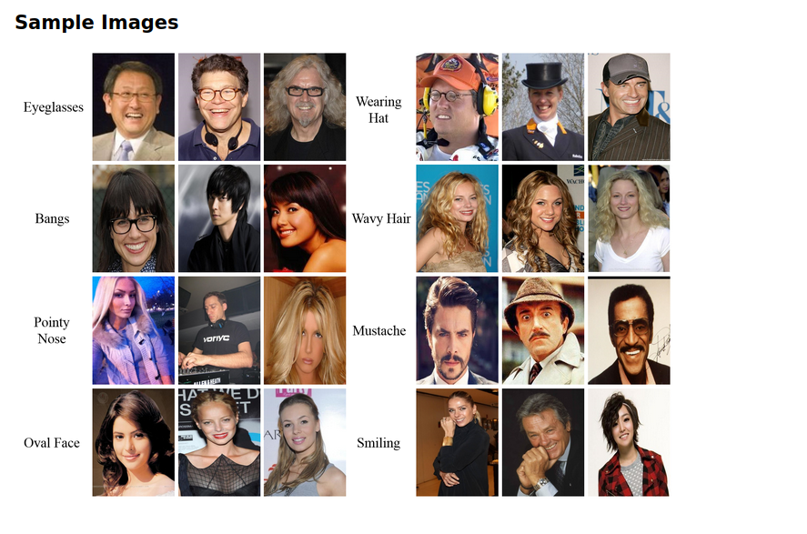
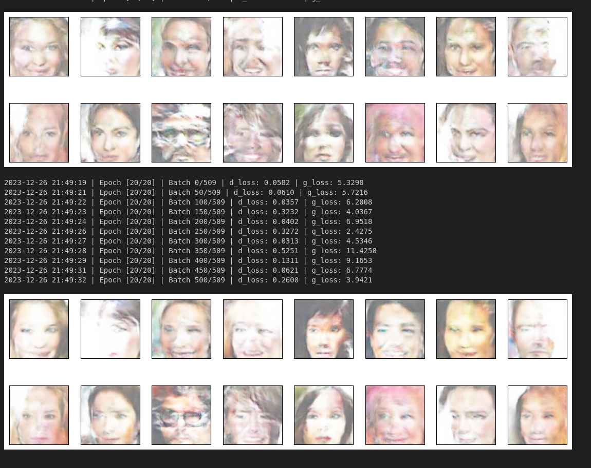
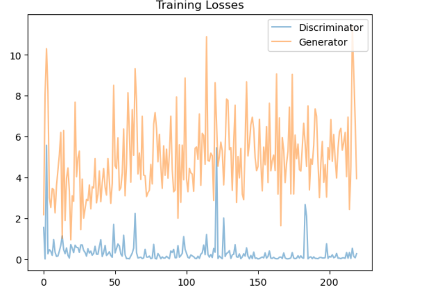

# Face Generation from Celeb Dataset with DC-GAN

In this project, we will define and train our own Generative Adversarial Network on a dataset of faces. The objective is to train a generator network to produce new images of faces that appear as realistic as possible!

## Dataset
http://mmlab.ie.cuhk.edu.hk/projects/CelebA.html

#### Sample from dataset

## generated faces after 40 epochs 

## loss through trainings
